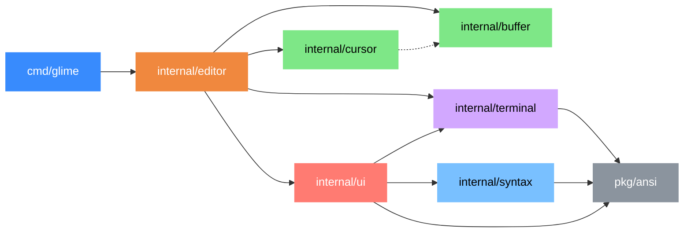

# Glime

A terminal-based modal text editor written from scratch in Go. Inspired by Vim's modal editing philosophy, Glime is lightweight, fast, and built with clean architecture.

## Features

- **Modal Editing** - Vim-inspired Normal, Insert, Command, and Search modes
- **Syntax Highlighting** - Go, JavaScript, and Python with a 256-color theme
- **File Explorer** - netrw-style directory browser (`:E` or open a directory)
- **Search** - Incremental forward (`/`) and backward (`?`) search with highlighting
- **Undo/Redo** - Grouped undo (`u`) and redo (`Ctrl+r`)
- **Yank & Paste** - Line and character-level copy/paste (`yy`, `dd`, `p`, `P`)
- **Bracket Matching** - Highlights matching brackets and parentheses
- **Status Bar** - Mode indicator, filename, language, cursor position, scroll percentage
- **Line Numbers** - Dynamic gutter with current line highlight

## UI
### Glime File Explorer:


### Glime File editor: 


## Diagrams

### Architecture

```mermaid
graph TB
      subgraph CMD["cmd/glime"]
          main["main.go<br/><i>Entry Point</i>"]
      end

      subgraph EDITOR["internal/editor"]
          editor["Editor<br/><i>State Machine</i>"]
          modes["Modes<br/>Normal · Insert · Command<br/>Search · Explore"]
          commands["Commands<br/>:w :q :wq :E :line"]
          multikey["Multi-Key<br/>Operator + Motion<br/>Count Prefix"]
          undo["Undo Manager<br/>Action Groups<br/>Undo/Redo Stack"]
          search["Search<br/>Regex Match<br/>Forward/Backward"]
          explorer["Explorer<br/>Directory Browser<br/>File Open"]
          register["Register<br/>Yank/Paste"]
          brackets["Brackets<br/>Match () {} []"]
          operations["Operations<br/>Word Motion"]
      end

      subgraph BUFFER["internal/buffer"]
          buf["Buffer<br/><i>[]string lines</i><br/>Insert / Delete"]
          fileio["File I/O<br/>Load / Save / Backup"]
      end

      subgraph CURSOR["internal/cursor"]
          cur["Cursor<br/><i>Row, Col, Offsets</i><br/>Scroll Management"]
      end

      subgraph TERMINAL["internal/terminal"]
          term["Terminal<br/><i>Raw Mode</i><br/>Screen Buffer"]
          keyboard["Keyboard<br/>Key Parsing<br/>Escape Sequences"]
      end

      subgraph UI["internal/ui"]
          renderer["Renderer<br/><i>Full Frame Render</i><br/>Atomic Write"]
          theme["Theme<br/>256-Color Palette<br/>Glime Modern Dark"]
          statusbar["Status Bar<br/>Segmented Design<br/>Mode Icons"]
      end

      subgraph SYNTAX["internal/syntax"]
          highlighter["Highlighter<br/>Tokenize & Colorize"]
          language["Language<br/>Go · JS · Python<br/>Regex Rules"]
      end

      subgraph ANSI["pkg/ansi"]
          ansi["ANSI Escape<br/>Colors 256/RGB<br/>Cursor Control"]
      end

      %% Main flow
      main -->|creates| editor

      %% Editor internals
      editor --- modes
      editor --- commands
      editor --- multikey
      editor --- undo
      editor --- search
      editor --- explorer
      editor --- register
      editor --- brackets
      editor --- operations

      %% Editor to core packages
      editor -->|"read/write text"| buf
      editor -->|"position & scroll"| cur
      editor -->|"buildView → Render"| renderer
      editor -->|"ReadKey / raw mode"| term

      %% UI connections
      renderer -->|"WriteStr"| term
      renderer -->|"Highlight per line"| highlighter
      renderer --- theme
      renderer --- statusbar

      %% Syntax
      highlighter --> language
      highlighter -->|"SetFgColor"| ansi

      %% Terminal
      term --- keyboard
      term -->|"escape codes"| ansi

      %% Cursor bounds
      cur -.->|"bounds checking"| buf

      %% Buffer file I/O
      buf --- fileio

      %% Styling
      classDef pkgStyle fill:#21262d,stroke:#30363d,color:#c9d1d9
      classDef editorStyle fill:#1c2128,stroke:#58a6ff,color:#c9d1d9
      classDef uiStyle fill:#1c2128,stroke:#f0883e,color:#c9d1d9
      classDef syntaxStyle fill:#1c2128,stroke:#a5d6ff,color:#c9d1d9
      classDef termStyle fill:#1c2128,stroke:#7ee787,color:#c9d1d9
      classDef ansiStyle fill:#1c2128,stroke:#8b949e,color:#c9d1d9

      class main,editor,modes,commands,multikey,undo,search,explorer,register,brackets,operations editorStyle
      class buf,fileio,cur pkgStyle
      class renderer,theme,statusbar uiStyle
      class highlighter,language syntaxStyle
      class term,keyboard termStyle
      class ansi ansiStyle
```


### Dependency Graph


## Quick Start

```bash
# Clone and build
git clone https://github.com/AdityaKrSingh26/Glime.git
cd Glime
go build -o glime ./cmd/glime

# Open a file
./glime main.go

# Open the file explorer in the current directory
./glime .

# Show help
./glime --help
```

## Modes

Glime has 5 modes. The current mode is shown in the status bar.

| Mode | Indicator | How to enter |
|------|-----------|--------------|
| Normal | `NOR` | Default. Press `ESC` from any other mode |
| Insert | `INS` | Press `i`, `a`, `A`, `o`, or `O` from Normal |
| Command | `CMD` | Press `:` from Normal or Explorer |
| Search | `SRCH` | Press `/` or `?` from Normal |
| Explorer | `EXPL` | Run `:E` or launch Glime with a directory |

## Key Bindings

### Normal Mode

#### Movement

| Key | Action |
|-----|--------|
| `h` / `Arrow Left` | Move left |
| `j` / `Arrow Down` | Move down |
| `k` / `Arrow Up` | Move up |
| `l` / `Arrow Right` | Move right |
| `w` | Jump to next word |
| `b` | Jump to previous word |
| `0` / `Home` | Go to start of line |
| `$` / `End` | Go to end of line |
| `gg` | Go to first line |
| `G` | Go to last line |
| `Page Up` | Scroll up one page |
| `Page Down` | Scroll down one page |

All movement keys accept a count prefix: `5j` moves down 5 lines, `3w` jumps 3 words.

#### Entering Insert Mode

| Key | Action |
|-----|--------|
| `i` | Insert before cursor |
| `a` | Insert after cursor |
| `A` | Insert at end of line |
| `o` | Open new line below and insert |
| `O` | Open new line above and insert |

#### Delete

| Key | Action |
|-----|--------|
| `x` | Delete character under cursor |
| `dd` | Delete current line (yanks it too) |
| `dw` | Delete from cursor to next word |
| `d$` | Delete from cursor to end of line |

Count prefix works: `3dd` deletes 3 lines, `2dw` deletes 2 words.

#### Yank (Copy)

| Key | Action |
|-----|--------|
| `yy` | Yank current line |
| `yw` | Yank from cursor to next word |
| `y$` | Yank from cursor to end of line |

Count prefix works: `3yy` yanks 3 lines.

#### Paste

| Key | Action |
|-----|--------|
| `p` | Paste after cursor (lines below, chars after) |
| `P` | Paste before cursor (lines above, chars before) |

#### Undo / Redo

| Key | Action |
|-----|--------|
| `u` | Undo last change |
| `Ctrl+r` | Redo |

#### Search

| Key | Action |
|-----|--------|
| `/` | Start forward search (type pattern, press `Enter`) |
| `?` | Start backward search |
| `n` | Jump to next match (same direction) |
| `N` | Jump to next match (opposite direction) |

Matches are highlighted in yellow. Press `ESC` to cancel a search in progress.

#### Other

| Key | Action |
|-----|--------|
| `:` | Enter command mode |
| `ESC` | Cancel pending operator |
| `Ctrl+c` | Quit immediately |

### Insert Mode

| Key | Action |
|-----|--------|
| Any character | Insert at cursor |
| `Enter` | Split line / new line |
| `Backspace` | Delete previous character (joins lines at column 0) |
| `Delete` | Delete character under cursor |
| `Arrow keys` | Move cursor |
| `ESC` | Return to Normal mode |

### Command Mode

Press `:` then type a command and hit `Enter`. Press `ESC` to cancel.

| Command | Action |
|---------|--------|
| `:w` | Save file |
| `:w filename` | Save as new filename |
| `:q` | Quit (fails if unsaved changes) |
| `:q!` | Force quit without saving |
| `:wq` | Save and quit |
| `:wq filename` | Save as and quit |
| `:x` | Same as `:wq` |
| `:{number}` | Jump to line number (e.g. `:42`) |
| `:E` | Open file explorer in current file's directory |
| `:E /path` | Open file explorer at given path |
| `:Explore` | Same as `:E` |

### File Explorer

Triggered by `:E` or by opening a directory (`./glime .`). Directories are shown in blue with a `>` prefix, files in green.

| Key | Action |
|-----|--------|
| `j` / `Arrow Down` | Move selection down |
| `k` / `Arrow Up` | Move selection up |
| `Enter` / `l` | Open file or enter directory |
| `h` / `-` | Go to parent directory |
| `g` | Jump to first entry |
| `G` | Jump to last entry |
| `q` / `ESC` | Quit explorer, restore previous buffer |
| `:` | Enter command mode (returns to explorer after) |

If your previous buffer has unsaved changes, opening a file from the explorer will be blocked with a warning.

## Project Structure

```
glime/
├── cmd/glime/          # Entry point
├── internal/
│   ├── buffer/         # Text buffer and file I/O
│   ├── cursor/         # Cursor position and scrolling
│   ├── editor/         # Editor state machine, commands, modes, explorer
│   ├── syntax/         # Syntax highlighting and language detection
│   ├── terminal/       # Raw terminal control and key reading
│   └── ui/             # Rendering, status bar, themes
└── pkg/
    └── ansi/           # ANSI escape code helpers
```

## Building from Source

Requires Go 1.24 or higher.

```bash
# Build
go build -o glime ./cmd/glime

# Run tests
go test ./...

# Vet
go vet ./...
```

## Architecture

Glime follows clean architecture with clear separation of concerns:

- **Terminal Layer** - Raw mode, ANSI escape codes, key reading, screen management
- **Buffer Layer** - Line-based text storage, file load/save with backup
- **Cursor Layer** - Position tracking, viewport scrolling, movement commands
- **Editor Layer** - Modal state machine, undo/redo, commands, search, file explorer
- **Syntax Layer** - Regex-based tokenization, language detection, ANSI colorization
- **UI Layer** - Screen rendering, status bar, line numbers, theme system
